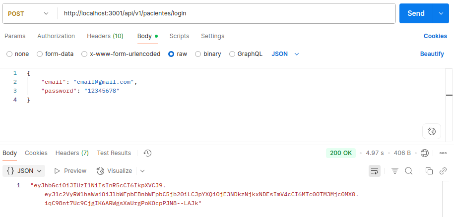
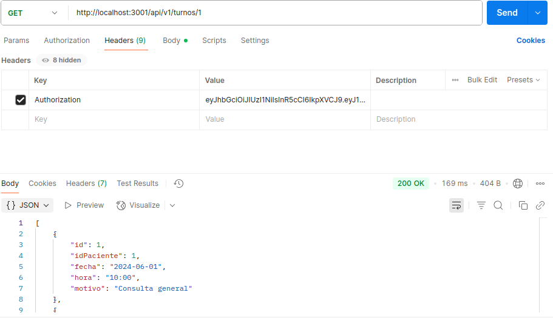
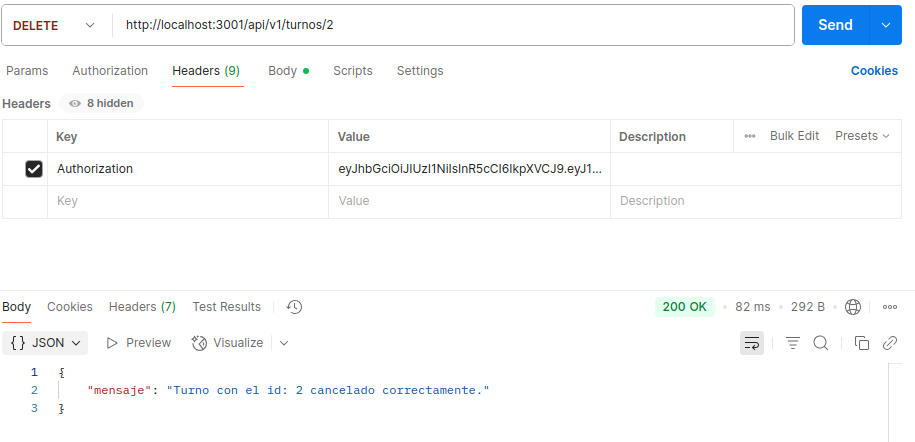
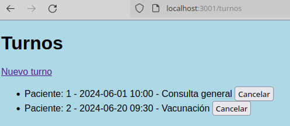
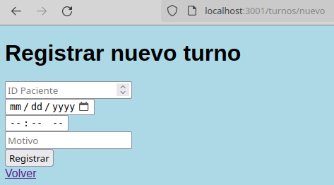
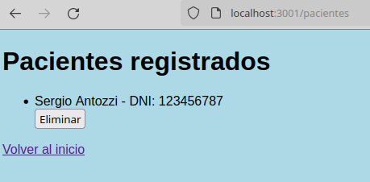
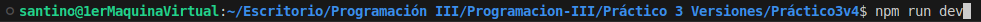
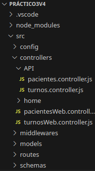

## Endpoints para acceder a las diferentes rutas:

**Versión Online (POSTMAN):**

http://localhost:3001/api/v1/pacientes/login

POST el siguiente JSON para recibir el token de acceso

---

http://localhost:3001/api/v1/turnos/:idPaciente

GET para consultar los turnos registrados para un paciente

---

http://localhost:3001/api/v1/turnos:idTurno

DELETE para cancelar un turno especifico a partir de su identificador

---

## Versión local:
http://localhost:3001/turnos/ <=== Para ver los turnos reservados y cancelarlos

---

http://localhost:3001/turnos/nuevo <=== Para registrar nuevos turnos para pacientes

---

http://localhost:3001/pacientes <=== Para dar de baja pacientes

---

## Cómo correr el proyecto:
Insertar en la terminal: npm run dev

## Integrantes del grupo:
Rodrigo Sisko, Josué Chazarreta y Santino Gullacci

## Info adicional:
Se crearon controllers aparte, para la parte de POSTMAN dentro de src/controllers/API y luego
para la versión web, dentro de src/controllers
